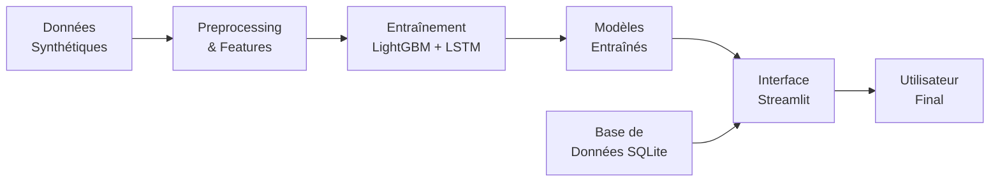

# ⚡ Dakar Power Prediction

> Système intelligent de prédiction des coupures d'électricité à Dakar utilisant Machine Learning et Deep Learning

[](https://www.python.org/)
[](https://streamlit.io/)
[](https://lightgbm.readthedocs.io/)
[](https://www.tensorflow.org/)
[](LICENSE)

---

## 📋 Table des Matières

- [Aperçu](#-aperçu)
- [Fonctionnalités](#-fonctionnalités)
- [Démo](#-démo)
- [Architecture](#-architecture)
- [Installation](#-installation)
- [Utilisation](#-utilisation)
- [Modèles ML](#-modèles-ml)
- [Résultats](#-résultats)
- [Structure du Projet](#-structure-du-projet)
- [Technologies](#-technologies)
- [Roadmap](#-roadmap)
- [Contribution](#-contribution)
- [Licence](#-licence)
- [Contact](#-contact)

---

## 🎯 Aperçu

**Dakar Power Prediction** est une application web intelligente qui prédit en temps réel le risque de coupure d'électricité pour 6 quartiers de Dakar. Le système combine deux modèles de Machine Learning (LightGBM et LSTM) pour fournir des prédictions fiables et exploitables.

### Problématique

Les coupures d'électricité à Dakar impactent négativement :
- 👨‍👩‍👧‍👦 **Ménages** : Équipements endommagés, alimentation gâchée
- 🏢 **Entreprises** : Productivité perdue, données non sauvegardées
- 🏭 **Industrie** : Coûts opérationnels élevés

### Solution

Une plateforme web accessible 24/7 qui permet d'**anticiper** les coupures pour mieux s'y préparer.

---

## ✨ Fonctionnalités

### 🎯 Prédiction Immédiate
- Prédiction en temps réel (< 1 seconde)
- Sélection du quartier
- Ajustement des paramètres météo et consommation
- Affichage du niveau de risque (Faible/Modéré/Élevé)
- Jauge visuelle colorée

### 🗺️ Carte Interactive
- Visualisation géographique des 6 quartiers
- Marqueurs colorés selon le niveau de risque
- Mise à jour automatique en temps réel
- Tableau récapitulatif

### 📊 Analyse par Quartier
- Statistiques historiques
- Graphiques comparatifs
- Taux de coupures par quartier

### 📈 Historique & Tendances
- Graphiques temporels (7 jours)
- Consommation et température
- Marqueurs de coupures réelles

---

## 🚀 Démo

### Application Web
🔗 **[Lien vers l'application déployée]** *(à venir)*

### Screenshots

<details>
<summary>📸 Cliquez pour voir les captures d'écran</summary>

#### Prédiction Immédiate


#### Carte Interactive


#### Analyse par Quartier


#### Historique


</details>

### Vidéo Démo
🎥 **[Lien vers la vidéo YouTube]** *(5 minutes)*

---

## 🏗️ Architecture



### Pipeline de Données

1. **Génération** : 52,560 observations (1 an × 6 quartiers)
2. **Feature Engineering** : 9 colonnes créées
3. **Entraînement** : LightGBM (2 min) + LSTM (8 min)
4. **Déploiement** : Interface Streamlit interactive

---

## 📦 Installation

### Prérequis

- Python 3.12+
- pip
- Git

### Étapes

```bash
# 1. Cloner le repository
git clone https://github.com/votre-username/dakar-power-prediction.git
cd dakar-power-prediction

# 2. Créer un environnement virtuel
python -m venv venv

# Activer l'environnement
# Windows
venv\Scripts\activate
# Linux/Mac
source venv/bin/activate

# 3. Installer les dépendances
pip install -r requirements.txt

# 4. Générer les données
python scripts/1_generate_data.py --import-db

# 5. Entraîner les modèles
python scripts/2_train_models.py

# 6. Lancer l'application
streamlit run streamlit_app/app.py
```

### Installation Rapide (Docker)

```bash
# Construire l'image
docker build -t dakar-power-prediction .

# Lancer le conteneur
docker run -p 8501:8501 dakar-power-prediction
```

Accédez à l'application sur `http://localhost:8501`

---

## 🎮 Utilisation

### Mode Développement

```bash
# Lancer avec auto-reload
streamlit run streamlit_app/app.py --server.runOnSave true
```

### Mode Production

```bash
# Avec configuration serveur
streamlit run streamlit_app/app.py \
  --server.port 80 \
  --server.headless true \
  --browser.gatherUsageStats false
```

### Exemple de Prédiction Programmatique

```python
from streamlit_app.utils import load_models, make_prediction_single

# Charger les modèles
lgbm, threshold_lgbm, lstm, threshold_lstm, scaler, encoder = load_models()

# Données d'entrée
input_data = {
    'temperature': 35.0,  # °C
    'humidite': 80.0,     # %
    'vent': 25.0,         # km/h
    'consommation': 1200.0 # MW
}

# Faire la prédiction
result = make_prediction_single(
    input_data, 
    'Guédiawaye',
    lgbm, threshold_lgbm,
    lstm, threshold_lstm,
    scaler, encoder
)

print(f"Probabilité de coupure : {result['proba_moyenne']*100:.2f}%")
print(f"Statut : {result['statut']}")
```

---

## 🤖 Modèles ML

### LightGBM (Modèle Principal) ⭐

**Type** : Gradient Boosting  
**Avantages** :
- Rapide (< 100ms par prédiction)
- Fonctionne sans historique
- Meilleur équilibre Precision/Recall

**Performances** :
- Accuracy : 74.72%
- Precision : 12.70%
- Recall : 44.13%
- **F1-Score : 19.72%** ⭐
- ROC-AUC : 65.94%

### LSTM (Réseau de Neurones)

**Type** : Long Short-Term Memory  
**Avantages** :
- Capture les tendances temporelles
- Utile pour prédictions à moyen terme

**Architecture** :
```
Input (12 timesteps, 9 features)
  ↓
LSTM (100 units) + Dropout(0.4)
  ↓
LSTM (50 units) + Dropout(0.4)
  ↓
Dense (32) + Dropout(0.3)
  ↓
Dense (16) + Dropout(0.2)
  ↓
Output (1, sigmoid)
```

**Performances** :
- Accuracy : 76.14%
- F1-Score : 14.91%
- ROC-AUC : 55.55%

### Ensemble Learning

Moyenne des probabilités des deux modèles pour plus de robustesse.

---

## 📊 Résultats

### Comparaison des Modèles

| Métrique | LightGBM | LSTM | Meilleur |
|----------|----------|------|----------|
| Accuracy | 74.72% | 76.14% | LSTM |
| Precision | 12.70% | 9.95% | **LightGBM** |
| Recall | 44.13% | 29.69% | **LightGBM** |
| **F1-Score** | **19.72%** | 14.91% | **LightGBM** ⭐ |
| ROC-AUC | 65.94% | 55.55% | **LightGBM** |

**Recommandation** : ✅ LightGBM choisi comme modèle principal

### Matrice de Confusion (LightGBM)

```
                Prédictions
            Pas Coupure  Coupure
          ┌─────────────┬────────┐
Réel      │             │        │
Pas Coup. │ TN: 7,234   │ FP: 607│
          ├─────────────┼────────┤
Coupure   │ FN: 318     │ TP: 251│
          └─────────────┴────────┘
```

### Importance des Features

1. **Consommation** (35%) - Plus fort prédicteur
2. **Quartier** (25%) - Zones à risque
3. **Température** (19%) - Chaleur = risque
4. **Heure** (13%) - Heures de pointe
5. **Heure de pointe** (8%) - Surcharge

---

## 📁 Structure du Projet

```
dakar_power_prediction/
│
├── data/                          # Données
│   ├── raw/                       # CSV brut
│   │   └── power_outages.csv
│   └── power_outages.db           # Base de données
│
├── models/                        # Modèles entraînés
│   ├── lgbm_model.joblib          # LightGBM
│   ├── lstm_model.h5              # LSTM
│   ├── scaler.joblib              # Normalisateur
│   ├── encoders.joblib            # Encodeurs
│   └── lstm_threshold.txt         # Seuil LSTM
│
├── src/                           # Code source
│   ├── __init__.py
│   ├── config.py                  # Configuration
│   ├── data_pipeline.py           # Pipeline données
│   ├── data_generator.py          # Générateur
│   └── database.py                # Gestion BD
│
├── scripts/                       # Scripts d'exécution
│   ├── 1_generate_data.py         # Génération
│   ├── 2_train_models.py          # Entraînement
│   └── 3_evaluate_models.py       # Évaluation
│
├── streamlit_app/                 # Application web
│   ├── app.py                     # Interface principale
│   └── utils.py                   # Fonctions utilitaires
│
├── evaluation_results/            # Rapports d'évaluation
│   ├── confusion_matrices.png
│   ├── roc_curves.png
│   ├── precision_recall_curves.png
│   └── evaluation_report_*.txt
│
├── docs/                          # Documentation
│   ├── screenshots/               # Captures d'écran
│   └── rapport_final.md           # Rapport technique
│
├── tests/                         # Tests unitaires
│   └── test_*.py
│
├── .gitignore                     # Fichiers ignorés
├── requirements.txt               # Dépendances Python
├── Dockerfile                     # Configuration Docker
├── README.md                      # Ce fichier
└── LICENSE                        # Licence MIT
```

---

## 🛠️ Technologies

### Langage & Frameworks
- **Python** 3.12
- **Streamlit** 1.40.2 - Interface web
- **Plotly** 5.24.1 - Visualisations

### Machine Learning
- **LightGBM** 4.5.0 - Gradient Boosting
- **TensorFlow** 2.18.0 - Deep Learning
- **scikit-learn** 1.5.2 - Preprocessing
- **imbalanced-learn** 0.12.4 - SMOTE

### Data Processing
- **Pandas** 2.2.3 - Manipulation données
- **NumPy** 2.1.3 - Calculs numériques

### Base de Données
- **SQLite** 3.x - Stockage

### Déploiement
- **Docker** - Conteneurisation
- **Streamlit Cloud** - Hébergement

---

## 🗺️ Roadmap

### ✅ Phase 1 - MVP (Complétée)
- [x] Pipeline de données complet
- [x] 2 modèles ML entraînés
- [x] Interface Streamlit 4 onglets
- [x] Documentation complète

### 🔄 Phase 2 - Amélioration (En cours)
- [ ] Déploiement Streamlit Cloud
- [ ] Collecte données réelles SENELEC
- [ ] Optimisation hyperparamètres
- [ ] Tests unitaires (coverage 80%+)

### 📅 Phase 3 - Extension (Q1 2026)
- [ ] Extension à 20+ quartiers
- [ ] Système d'alertes (email, SMS)
- [ ] API REST
- [ ] Monitoring en production

### 🚀 Phase 4 - Mobile (Q2 2026)
- [ ] Application iOS
- [ ] Application Android
- [ ] Notifications push
- [ ] Mode hors-ligne

### 🤝 Phase 5 - Partenariat (Q3 2026)
- [ ] Partenariat SENELEC
- [ ] Intégration données temps réel
- [ ] Prédictions 24h-72h
- [ ] Dashboard administrateur

---

## 🤝 Contribution

Les contributions sont les bienvenues ! Voici comment participer :

### 1. Fork le Projet

```bash
# Cloner votre fork
git clone https://github.com/votre-username/dakar-power-prediction.git
```

### 2. Créer une Branche

```bash
# Créer une branche pour votre feature
git checkout -b feature/AmazingFeature
```

### 3. Commit vos Changements

```bash
# Commit avec message descriptif
git commit -m 'Add: AmazingFeature'
```

### 4. Push vers la Branche

```bash
git push origin feature/AmazingFeature
```

### 5. Ouvrir une Pull Request

Ouvrez une PR sur GitHub avec une description détaillée.

### Règles de Contribution

- ✅ Code documenté (docstrings)
- ✅ Tests unitaires (pytest)
- ✅ Respect PEP 8 (flake8)
- ✅ Commit messages clairs
- ✅ PR avec description détaillée

---

## 🧪 Tests

```bash
# Installer les dépendances de test
pip install pytest pytest-cov

# Lancer tous les tests
pytest

# Avec coverage
pytest --cov=src --cov-report=html

# Tests spécifiques
pytest tests/test_data_pipeline.py -v
```

---

## 📄 Licence

Ce projet est sous licence **MIT**. Voir le fichier [LICENSE](LICENSE) pour plus de détails.

```
MIT License

Copyright (c) 2025 [Votre Nom]

Permission is hereby granted, free of charge, to any person obtaining a copy
of this software and associated documentation files...
```

---

## 📧 Contact

**Développeur** :(Cheikh Niang) 
**Email** :(cheikhniang159@gmail.com)
**LinkedIn** :(https://www.linkedin.com/in/cheikh-niang-5370091b5/)  
**GitHub** :(https://github.com/dashboard)

**Lien du Projet** :(https://github.com/chniang/Dakar_power_prediction)

---

## 📚 Ressources Supplémentaires

- 📖 [Documentation Technique Complète](docs/rapport_final.md)
- 🎥 [Vidéo Tutoriel](lien-youtube)
- 📊 [Slides de Présentation](lien-slides)
- 🌐 [Application Déployée](lien-app)

---

## ⭐ Star History

[](https://star-history.com/#votre-username/dakar-power-prediction&Date)

---

## 🔖 Citation

Si vous utilisez ce projet dans votre recherche, veuillez citer :

```bibtex
@software{dakar_power_prediction,
  author = {Votre Nom},
  title = {Dakar Power Prediction: Système de Prédiction des Coupures d'Électricité},
  year = {2025},
  url = {https://github.com/votre-username/dakar-power-prediction}
}
```

---

<div align="center">

**Développé avec ❤️ à Dakar, Sénégal**

⚡ **Anticiper pour mieux préparer** ⚡

[⬆ Retour en haut](#-dakar-power-prediction)

</div>


